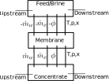

# The Motivation
The goal of this project is to develop a Simscape toolbox for modeling solution dynamics. One major application of this domain is in modeling reverse/forward osmosis, with reverse osmosis being important in desalination. This fills a major gap in available desalination modeling software. While models like WAVE and WaterTap can model steady state desalination, this Simscape tool is capable of modeling transient desalination dynamics. Transient behavior has been avoided in the past, but is a growing area of interest in research. A experimental study has shown that unsteady operation is not as detrimental to the membrane as previously thought, and can even improve performance in some cases. Additionally as the need for desalination increases, more innovative solutions will be required to meet the demand. This will lead to increased interest in novel technologies like wave-driven desalination, which will require transient modeling capabilities. Although the focus of this project is on desalination, we believe that this solution domain could be applied to a wide variety of other applications where transient solution dynamics are important.

# Variables
Variables are defined in the table below:

| Variable | Symbol | Type| Units |
|:--------:|:-:|:----------:|:--:|
| Concentration | $x$| State Variable | kg/m³ |
| Pressure | $P$ | Reservoir Parameter | Pa |
| Temperature | $T$ | Reservoir Parameter | K |
| Solute Flow Rate | $\dot{m}_w$ | Through Variable | kg/s |
| Solvent Flow Rate | $\dot{m}_x$ | Through Variable | kg/s |
| Energy Flux | $\Phi$ | Through Variable | W |
| Density | $\rho$ | Intermediate Variable | kg/m³ |
| Membrane Permeability | $A_w$ | Membrane Parameter (TLU later)  | m³/(N·s) |
| Solute Transport Parameter | $B_s$ | Membrane Parameter (TLU later)  | m/s |
| Membrane Area | $A_m$ | Membrane Parameter | m² |
| Brine Resistance | $R_B$ | Membrane Parameter | Pa·s/m³ |
| Osmotic Pressure | $\pi$ | Intermediate Variable | Pa |
| Ion count | $i$ | Fluid Parameter | - |
| Solute molar mass | $M$ | Fluid Parameter | kg/mol |
| Density of Water | $\rho_w(T,P)$ | Fluid TLU | kg/m³ |
| Fluid Internal Energy | $u(T,P)$ | Fluid TLU | J/kg |
| Ideal Gas Constant | $R$ | Fluid Property | J/(mol·K) |

Subscript $A$ refers to the feed (inlet seawater), $B$ refers to the brine (waste product), and $C$ refers to the permeate (product, freshwater). 

# Current Status
Currently, the basic membrane functionality is complete. There is a solution domain that builds upon the thermal liquid domain, but adds an additional state variable for concentration. We've created the solution domain, reservoirs, flow resistance blocks, modified constant volume chambers, and a membrane transport modeling block. These components are capable of modeling membrane behavior and have been validated against WaterTap for steady state operation. The blocks ensure mass conservation of both the solvent and solute separately enabling proper evaluation of the brine and permeate concentrations. 

## Components: Reservoirs, Flow Resistances, Valves, Sensors, and Sources
These elements don't include any new functionality beyond what is available in the thermal liquid domain. But were rewritten to support the new solution domain and were necessary to model the membrane transport behavior. 

## Components: Constant Volume Chamber, Pipe and Translational Mechanical Converter
Both of these components were modified from the thermal liquid domain to include additional inputs for transfer of mass of solvent, mass of solute, and energy. This allows these components to interface with the membrane transport block discussed next.

## Components: Membrane EQs
This component facilitates the transfer of, solvent, solute, and energy across a membrane. The governing membrane transport equations are shown below:
$$A_w A_m \big((P_A-P_B) - (\pi_A - \pi_B)\big) = \frac{\dot{m}_{w,B}}{\rho_w(T,P_B)}$$
$$B_s A_m \big( x_A - x_B \big) = \dot{m}_{x,B}$$
$$\dot{m}_{w,B}u(T_A,P_A) = \phi_B$$
where the subscripts A and B represent the two sides of the membrane. The first equation describes the solvent transport through the membrane, while the second describes the solute transport through the membrane. The third describes the energy transfer through the membrane. Each of the mass transfer equations require the osmotic pressure of each side of the membrane, which we can calculate as follows:
$$\pi = i \frac{x}{M}RT$$
More information on the osmotic pressure calculation can be found in the `docs/Theory/Osmotic Pressure.pptx` slide deck.

Mass and energy conservation is ensured through the following equations:
$$\dot{m}_{w,A} + \dot{m}_{w,B} = 0$$
$$\dot{m}_{x,A} + \dot{m}_{x,B} = 0$$
$$\phi_A + \phi_B = 0$$

## Components: Unit Membrane and Membrane
By combining two of the modified constant volume chambers, pipes, or translational mechanical converters with a membrane transport block, we can model forward or reverse osmosis dynamics. An example schematic (specific to reverse osmosis desalination) is shown below:
{fig-align=center width=230}
The membrane transport block connects the two chambers to facilitate the transfer of solvent, solute, and energy across the membrane. Using the translational mechanical converters allows us to model the classic manometer experiment as shown in `OsmoticPressure.m`. Using pipes instead would allow us to model something like a reverse osmosis desalination unit. To properly do this however, units (consisting of two chambers, pipes in this case, and a membrane transport block) are linked together to form a full membrane model. This enables modeling dynamics like concentration polarization and pressure drops across the membrane unit. For convenience we have created a `Membrane` that strings together multiple membrane units in series.

# Validation
To validate the membrane transport block, we compare steady-state results against WaterTAP, [https://watertap.readthedocs.io/en/latest/](https://watertap.readthedocs.io/en/latest/), a steady-state water treatment modeling software developed by NREL, capable of modeling reverse osmosis desalination. We set up a simple RO unit in WaterTAP and compared the permeate flow rate and concentration against our Simscape membrane model, both modeling Du Pont’s SW30HR-380 and operating under the same conditions, 50 bar feed pressure, 0.948 kg/s water feed flow rate, and 0.0294 kg/s salt feed flow rate. The results are shown in the table below:

||WaterTAP|Simscape|% Difference|
|--------|:------:|:------:|:----:|
|Permeate Water Flow Rate (kg/s)|0.163|0.168|3.1%|
|Permeate Salt Flow Rate (kg/s)|3.1x10$^-5$|2.9x10$^-5$|6.5%|
|Brine Water Flow Rate (kg/s)|0.815|0.780|4.3%|
|Brine Salt Flow Rate (kg/s)|0.0294|0.0294|0.0%|

The results show a decent match between the two models. It is worth noting that we believe the differences come from some improvements the Simscape model makes over the WaterTAP model. The Simscape model ensures mass conservation, and much of the discrepancy in the results is likely due WaterTAP conserving volume instead. Additionally, the Simscape model accounts for changes in concentration (and therefore osmotic pressure) across the membrane.