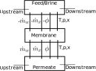

# Problem to Solve
This looks to build off the idea presented in the custom TL domain tutorial, but also accounts for species balance. This will allow for modeling brine. Additionally, this problem aims to measure the density of the solution, accounting for the solute in the calculation. Here is a schematic of the problem:
{fig-align=center width=190}

For this problem, I will start by assuming no volume in the membrane. This means that we use a mass balance approach. If we assumed volume in the membrane component, there would be an additional set of states required to track the composition of the fluid in the membrane component, which would add a couple of equations. I'll note them at the end.

## Variables
Variables are defined in the table below:

| Variable | Symbol | Type| Units |
|:--------:|:-:|:----------:|:--:|
| Concentration | $x$| State Variable | kg/m³ |
| Pressure | $P$ | Reservoir Parameter | Pa |
| Temperature | $T$ | Reservoir Parameter | K |
| Solute Flow Rate | $\dot{m}_w$ | Through Variable | kg/s |
| Solvent Flow Rate | $\dot{m}_x$ | Through Variable | kg/s |
| Energy Flux | $\Phi$ | Through Variable | W |
| Density | $\rho$ | Intermediate Variable | kg/m³ |
| Membrane Permeability | $A_w$ | Membrane Parameter (TLU later)  | m³/(N·s) |
| Solute Transport Parameter | $B_s$ | Membrane Parameter (TLU later)  | m/s |
| Membrane Area | $A_m$ | Membrane Parameter | m² |
| Brine Resistance | $R_B$ | Membrane Parameter | Pa·s/m³ |
| Osmotic Pressure | $\pi$ | Intermediate Variable | Pa |
| Ion count | $i$ | Fluid Parameter | - |
| Solute molar mass | $M$ | Fluid Parameter | kg/mol |
| Density of Water | $\rho_w(T,P)$ | Fluid TLU | kg/m³ |
| Ideal Gas Constant | $R$ | Fluid Property? | J/(mol·K) |

Subscript $A$ refers to the feed, $B$ refers to the brine, and $C$ refers to the permeate. 

## Assumptions
We assume that the system is at steady state, that the mixing is perfect, and no gradient of salt concentration. We assume we know the concentration of the feed ($x_A$).

# Equations

## Density Calculation
The density for each fluid is defined as:
$$\rho = \rho_w(T,P) + x$$
This allows us to calculate the density of the solution, provided we have 3 state variables: temperature, pressure, and concentration.

## Species Conservation
The governing solvent mass flow balance equation is shown below:
$$\dot{m}_{w,A} + \dot{m}_{w,B} + \dot{m}_{w,C} = 0$$ 
This leaves us with 3 unknowns: $\dot{m}_{w,A}$, $\dot{m}_{w,B}$, and $\dot{m}_{w,C}$. 

The governing solute flow balance equation is shown below:
$$\dot{m}_{x,A} + \dot{m}_{x,B} + \dot{m}_{x,C} = 0$$
This ensures that the mass of the solute is conserved in addition to the entire solution mass.

## Membrane Equations
The governing membrane transport equations are shown below:
$$A_w A_m \big((P_C-P_A) - (\pi_C - \pi_A)\big) + \frac{\dot{m}_{w,C}}{\rho_w(T,P_C)} = 0$$
$$B_s A_m \big( x_A - x_C \big) + \dot{m}_{x,C} = 0$$
The first equation describes the solvent transport through the membrane, while the second describes the solute transport through the membrane. Both equations require the osmotic pressure of the feed and permeate, which we can calculate as follows:
$$\pi = i \frac{x}{M}RT$$

## Brine Resistance
Without some sort of resistance to flow on the brine side, there would be no flow through the membrane. Plus it would cause solver issues then if $P_A$ and $P_B$ were inequal. This pressure balance equation related to the brine side resistance is shown below:
$$ P_A - P_B + \frac{\dot{m}_{x,B}}{\rho_w(T,P_B)} R_B = 0 $$

# Implementation Plan

The plan for modeling a segment of the membrane is shown below:
{fig-align=center width=230}

The membrane will take in inputs about the state of the two tanks and use the equations described earlier to calculate the mass flow rates of the water and solute through the membrane. Note that the brine resistance will be applied on the downstream side of the feed/brine tank, and is a separate component from the membrane.

## Domain Parameters
For a given fluid, the user would need to define the following parameters:

| Parameter | Symbol |
|----------|:---:|
| Density of Solvent Table | $\rho_w$ |
| Ion Count | $i$ |
| Solute Molar Mass | $M$ |
| Ideal Gas Constant | $R$ |

## Membrane Parameters
For a given membrane, the user would need to define the following parameters:

| Parameter | Symbol |
|----------|:---:|
| Water Permeability | $A_w$ |
| Solute Permeability | $B_s$ |
| Membrane Area | $A_m$ |

## Inputs
We need three state variables from each tank, described in the table below:

| Variable | Symbol |
|----------|:---:|
| Concentration | $x$ |
| Pressure | $P$ |
| Temperature | $T$ |

## Outputs
The outputs are the mass flow rates of the water and solute through the membrane, as well as the energy flux through the membrane. The outputs are described in the table below:

| Variable | Symbol |
|----------|:---:|
| Water Flow Rate | $\dot{m}_{w}$ |
| Solute Flow Rate | $\dot{m}_x$ |
| Energy Flux | $\Phi$ |

There are two sets of outputs, one for the feed side, and one for the permeate side. The feed and permeate sides are the same magnitude, but opposite sign to conserve mass and energy.

## Intermediate Variables
These will be intermediate variables:

| Variable | Symbol |
|----------|:---:|
| Osmotic Pressure | $\pi$ |
| Density of Water | $\rho_w$ |

## Equations
We need an equation for each output variable. We will use the membrane transport equations to calculate $\dot{m}_{w}$ and $\dot{m}_x$ on the permeate side. The feed side will be the same magnitude, but opposite sign. The energy flux can be calculated as follows:
$$\Phi = \dot{m} c_p T$$
where $c_p$ is the specific heat capacity of the solution. Notably, $\dot{m}$ has no subscript, and ideally it accounts for the mass flow rate of both the water and solute. Additionally, the specific heat capacity, $c_p$, of the solution should ideally be determined for the specific solution, but for now we will assume it is not a function of the concentration. Again, the equation shown above was for the permeate side, and the feed side will be the same magnitude, but opposite sign.
