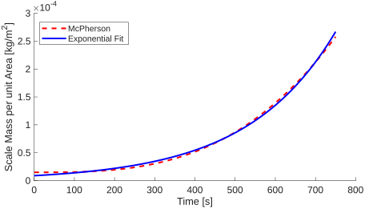
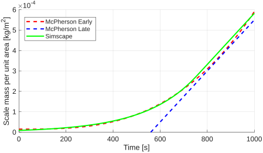

# The Motivation
Scaling in SWRO is the growth of mineral deposits on the surface of the membrane, reducing the effective membrane area and thus reducing the permeate production. What makes this a particularly compelling addition to the existing transient desalination modeling capabilities is that scaling is a transient phenomenon, and necessitates non constant operating conditions to be properly modeled. 

# Will it scale?
Lots of literature discusses predicting if scaling will happen or not. There are two main variables (very similar) that are used to predict scaling. The Saturation Index ($SI$) and the Supersaturation Ratio ($S_r$). Both are functions of the ion activity product ($IAP$) and the solubility product ($K_{sp}$). The equations are shown below:
$$SI = log\bigg(\frac{IAP}{K_{sp}}\bigg)$$
$$S_r = \sqrt{\frac{IAP}{K_{sp}}}$$
If $SI > 0$ or $S_r > 1$, scaling is likely to occur. Effectively these say the same thing if the ion activity product exceeds the solubility product, scaling is likely to occur.

The ion activity product is a function of the concentration of ions in solution, and can be calculated as follows:
$$IAP = \prod_{i=\text{ions}} \gamma_i[i]$$
where $\gamma_i$ is the activity coefficient of ion $i$, and $[i]$ is the concentration of ion $i$ in mol/L. We already have the concentration of ions in kg/m³ from our solution domain, so we can convert to mol/L with an added fluid property for molar mass ($M_x$). The activity coefficient and the solubility product can probably be dependent variables in the future, but for now I will treat them as constant fluid parameters.

# From looking at plots and Nate thinking...
Just knowing if scaling will occur is not sufficient for what we would like to model. This does not help us track performance over time as scaling builds up, or help us understand operational strategies to mitigate scaling. To do this we need to model the rate of scaling. 
While there are many models for determining if scaling will occur, there are less models for scaling rate. From some plots online, it appears that the growth rate is an exponential function. The scale size vs time plots generally start low, then gow into exponential till it hits a max slope. The growth rate seems to be dependent on 2 things, concentration (or rather $SI$) and size of existing scale. 

From a source, the growth rate appears to take this form:

$$\frac{dM_\text{scale}}{dt} = A(1 - e^{-t/\tau})$$

where $A$ is a maximum growth rate, that we see once the scale has some sort of critical mass and $\tau$ is a time constant that determines how quickly we reach that max growth rate. This equation makes a lot of sense to me,  as growth rate should increase as the scale gets larger (increased area for more particles to attach to), but at some point when the membrane is covered, the growth rate should plateau. But then it should probably also eventually reach a maximum scale mass. So maybe a better model would be:

$$\frac{dM_\text{scale}}{dt} = A(1 - e^{-t/\tau})(1 - \frac{M_\text{scale}}{M_\text{max}})$$

where $M_\text{max}$ is the maximum mass of scale that can build up on the membrane. This equation captures the initial increase in growth rate as scale builds up, but also captures the eventual plateauing of scale mass as it approaches a maximum value.

Unfortunately, I have not been able to find any sources that use such an equation, most are far too detailed for our purposes. Moving forward I'm going to look into general crystal growth models instead of specifically SWRO scaling models.

# From Textbook
Rates of crystallization are typically empirical. There are two main stages. The diffusional stage is where solute is transported from the fluid and onto the crystal surface. The deposition stage is where the solutes on the crystal surface integrate into the lattice structure. The textbook describes both stages of growth with:

$$\frac{dm}{dt} = k_dA(c-c_i) = k_rA(c_i-c^*)^i$$

where $k_d$ and $k_r$ are the diffusion and deposition rate or reaction mass transfer coefficient constant, $A$ crystal surface area, and $c$, $c_i$, and $c^*$ are the solute concentrations in the bulk solution, at the interface and at equilibrium saturation.

Because $c_i$ is a function of the mass transfer onto the crystal surface, the two equations can be linked together. If we assume the solvent does not experience any net mass transfer, $c_i$ is governed by this differential equation:

$$\frac{dc_i}{dt} = \frac{dm_\text{diffusion}}{dt} - \frac{dm_\text{deposition}}{dt} = k_dA(c-c_i) - k_rA(c_i-c^*)^i$$

Since $c_i$ can't easily be measured, it is common to simplify to this:

$$\frac{dm}{dt} = K_G(c - c^*)^s$$

In aqueous solutions, $s$ is often between 1 and 2. $K_G$ is related to $k_d$, $k_r$, $s$, and $i$, but it's probably better to just use $K_G$ since again knowing $c_i$ is difficult.

Interesting here that they do not use the saturation index or supersaturation ratio, but instead use the concentration directly. 

# Proposed Mass Model

I think we can use the textbook model to create a good $A$. The text book admits after it gives that model though that it is very simple and doesn't capture the size dependence of growth rate. By including that exponential term I had before I think we can capture that size dependence with a simple and intuitive time constant. 

$$\frac{dM_\text{scale}}{dt} = K_G(c - c^*)^s(1 - e^{-t/\tau})$$

Often this equation ends up looking like one of the earlier equations depending on which stage is rate limiting. If diffusion is rate limiting, then $K_G$=$k_dA$ and $s$=1. If deposition is rate limiting, then $K_G$=$k_rA$ and $s$=$i$.

But I do still feel the lack of a maximum scale mass is a major gap. 

# Problems

As I implement this model I see some problems. First, there is no behavior to keep scale mass from dropping below zero. However, I think an improved model where the $e^{-t/\tau}$ term is replaced with a size dependent term. 

The second problem is we need a new mass balance equation for the solute. Initially I was building the scaling model into the membrane eqs block. However, after thinking some more, I think a better approach is to have a separate scaling eqs block. The mass transfer of the scaling block can be summed with the mass transfer of the membrane block, and the properties of the volume will be routed to both blocks. This not only makes the mass balance work out, but also allows for modeling scaling in pipes generally, so not just on RO membrane. Note that we will need to make area an input rather than a parameter in the membrane EQs block in this version.

The final problem is one I don't have a good solution for yet. We can easily$^*$ create a model for membrane area loss as a function of scale mass. However, when I had been thinking about this problem before, I was only thinking of situations where there is only scaling on one side of the membrane. Without knowing which side of the membrane the scaling is on, if we assume scaling on one side is minor, an easy way to deal with this is just to use max(area loss A, area loss B), or to keep things smooth, area loss area loss A + area loss B. However, if we have significant scaling on both sides of the membrane, this approach will over predict area loss. There is likely a stats solution here.

# Scale size dependence model

I want to replace this part of the equation:

$$(1 - e^{-t/\tau})$$

with something that depends on scale size. A sigmoid function would be a good choice here. Something like this:

$$\frac{1}{1 + e^{-A(M_\text{scale}-B)}}$$

Trick is what are $A$ and $B$. $A$ is similar to our time constant from before. $B$ is critical because we want this function to be near 0 when $M_\text{scale}$ is near 0. But the number makes that work is dependent on $A$.

Alternatively, since setting smooth limits is actually already a function in simscape, we can just use scale area, $A$. Just throwing area into the equation makes the equation look more like those first equations from the textbook:

$$\frac{dM_\text{scale}}{dt} = k_gA(c - c^*)^s$$

where $k_g$ switches between $k_d$ and $k_r$ depending on the limiting mass transfer mode.

For now, I make $A$ a linear function of $M_\text{scale}$ using a ``specific area" term,  $a$ \[m$^2$/kg\].

$$A = aM_\text{scale}$$

However, there also needs to be some limits. First, the scale area can't exceed a maximum area (area of membrane or pipe surface). Second, if the mass of the scale is zero, this means there would never be growth. To prevent this, we set the minimum area to the nucleation area. These limits are set using a Simscape blend function for each limit. 

# Scale Mass Limits

This is the trickier part, I'm ignoring max for now, but probably should add eventually.

The minimum is zero

# Scale detachment

In backwashing, SWRO membranes don't just have the scale dissolved, but the scale is broken off of the membrane wall. Often using osmotic pressure as the driver. So for our scaling eqs block, we need an additional input of pressure difference, which represents the total pressure difference across the scale (both osmotic and hydraulic).

From here we need a model for rate of scale removal. In real systems, different spots on the scale will be bonded to the membrane with different strengths. For this simple model, I propose having one average bond strength term. The challenge is then modeling as a rate, when our parameter description of the system suggests the scale should just detach in one instant.

One paper I've reviewed focused on the mixing of the broken scale, so not very helpful here, but the lack of any mention of any scale breaking dynamics suggests and instead a strong focus on flushing suggests that this happens quickly.

Another paper that seems more relevant for the type of modeling we do here looks at a mix of rinsing an backwashing, although not explicitly for SWRO, seems to have the relevant behavior described.

This paper models things in "reverse", calculating the pressure drop across the membrane during the cleaning process instead of using a pressure drop to drive the cleaning. They open by saying that the pressure required to clean at any time is simply the pressure required to clean at time 0, multiplied by two factors, one that represents the change in resistance, and one that represents the change in area. The area is what I want to focus on. It is unfortunate that they focus on area and not mass, but oh well, I can make do.

For the area change they use this equation:

$$\frac{dA_{cleaned}}{dt} = \alpha Q_{backwash}$$

where $\alpha$ [m$^2$/m$^3$] is doing a lot of work describing this process. The trick is how do I get $\alpha$. They have some examples measured from experiments, but I kinda disagree with constants being here.

As more of the membrane is unblocked, it is going to required more flow rate to remove the same area of scale. Simply because initially all flow has to go though the scale, but as the scale is removed, much of the flow will avoid the scale.

# Parameters

From figure 3 in McPherson et al. (2022), the max growth rate is 1.25 $\times$ 10$^{-9}$ mol/cm$^2$/s. This is for CaCO$_3$, which has a molar mass of ~100 g/mol, making the max growth rate in kg 1.25 $\times$ 10$^{-6}$kg/m$^2$/s. Given our scale growth equation:

$$\frac{dM_\text{scale}}{dt} = k_gA(c - c^*)^s$$

we therefore need $k_g(c - c^*)^s$ to equal 1.25 $\times$ 10$^{-6}$kg/m$^2$/s. This will inform our choice of $k_g$. I'm going to stick with the $s$=1 assumption, and the paper give us the concentration used, Ca$^{2+}$ is 20 mM and CO$_3^{2-}$ is 10 mM. I find it rather annoying that they do't use the same for the two ions because this makes it require multi species. I'm going to just set the CO$_3^{2-}$ concentration as my concentration since that is the limiting solute. 10 mM, given the CaCO$_3$ molar mass of ~100 g/mol and the H$_2$O molar mass of ~18 g/mol, is equivalent to 55.56 m(kg/kg). And if we assume a water density of ~998 kg/m$^3$, is equivalent to 55.4 kg/m$^3$, kilograms of solute per meter cubed of solvent. This is our $c$. Next we need the equilibrium concentration $c^*$. The McPherson paper lists the solubility product for calcite is 3.47 $\times$ 10$^{-6}$ mol$^2$/L$^2$, corresponding to an equilibrium concentration of 5.89 $\times$ 10$^{-5}$ mol/L or 5.89 $\times$ 10$^{-3}$ kg/m$^3$. Given all that, to make the max slope appear, we need $k_g$ to be:

$$k_g = \frac{1.25 \times 10^{-6}kgm^{-2}s^{-1}}{( 55.4 kg/m^3 - 5.89 \times 10^{-3} kg/m^3)} = 22.6 \times 10^{-9} m/s$$

Next parameter we need is the ``specific area of scale", $a$. Since this effectively sets the speed at which we get to that max growth rate, we should relate it to the coefficient in front of the cubic term (5.76 $\times$ 10$^{-16}$ mol cm$^{-2}$ s$^{-3}$) from the McPherson plot. Following the same unit conversion steps for the linear coefficient, this is equivalent to 5.76 $\times$ 10$^{-13}$ kg m$^{-2}$ s$^{-3}$. Now comes the hard part. We don't have a term dependent on time cubed, but we do have an exponential that we would like to relate to this term. Rewriting our growth equation with a max slope, $K_{max}$ [kg m$^{-2}$ s$^{-1}$], and substituting in $aM_\text{scale}$ in for $A$, we get

$$\frac{dM_\text{scale}}{dt} = K_{max}aM_\text{scale}$$

a simple first order ODE, where $(K_{max}a)^{-1}$ [s] is our time constant $\tau$. This makes our solution:

$$M_\text{scale} = C_0e^{t/\tau}$$

or for a unit area:

$$M_\text{scale}/A_{max} = C_0e^{t/\tau}$$

Now because we bound the area, we don't truly see this behavior, but for this $a$ coefficient, we only care about the behavior before hitting that max slope point. The y intercept from the McPherson plot is 1.48 $\times$ 10$^{-8}$ mol cm$^{-2}$, or 1.48 $\times$ 10$^{-5}$ kg m$^{-2}$. So our goal is to find a pair of $C_0$ and $\tau$ that best makes this match up:

$$M_\text{scale}/A_{max} = C_0e^{t/\tau} = 1.48 \times 10^{-5} + 5.76 \times 10^{-13}t$$

over the time spanning 0s to ~750s. We can then use that to set both $a$, from $\tau$ ($(K_{max}a)^{-1} = \tau$), and $A_\text{nucleation}$, from $C_0$ ($\frac{A_\text{nucleation}}{aA_{max}} = C_0$).

Using MATLAB curve fitter, we get a value of 8.831 $\times$ 10$^{-6}$ kg/m$^2$ for $C_0$ and 0.004545 s$^{-1}$ for $\tau^{-1}$. This fit is shown in the figure below.

These curve fit terms correspond to a specific area of 3636 m$^2$/kg and a nucleation area of 0.0321 $A_{max}$. These jump of the page as being a bit large to me, as 3\% of the membrane covered at nucleation seems a bit much. The large specific area is responsible for both looking large. Although it is worth noting that this experiment is at a much smaller scale. Even so the 3636 m$^2$/kg seems really big for the specific area of the scale. Let's make a plot first, my goal is to replicate the figure 3 plot from McPherson using my new coefficients and solution domain model of scaling. McPherson uses a flow rate of  2 mL/min, in this case the pressure and temperature are not terribly important. This plots looks good though:

You might wonder why there is a gap between the blue an green above. The reason for it is that at the larger scale masses, more of the solute concentration is on the scale instead of dissolved reducing the $(c - c^*)^s$ coefficient on the max growth rate. If I was tuning my model more I would use the concentration we see at the max scale growth rate point instead of the input concentration for $c$ in the $k_g$ tuning, and iterate this process until convergence.
